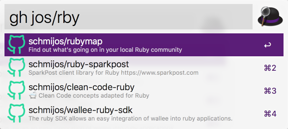

# Fast Fuzzy Github Repos

Alfred plugin to retrieve your own Github repositories fuzzy and fast.

Written in JavaScript with [alfy](https://github.com/sindresorhus/alfy).



## Installation

```
npm install --global @renuo/alfred-fast-fuzzy-github-repos --@renuo:registry=https://npm.pkg.github.com
```

## Actions

The idea is that you manually sync down your Github repository list.
This allows the search to always perform on local data.

* `gh-token <token>`
  Set's up the Github token authorization. If you want to access
  your private repos and your organisation's repos, the token scope should
  minimally be (*read:org*, *repo:status*).
* `gh-sync`
  Downloads the repository list over the Github v4 API.
* `gh <fuzzy repo>`
  Fuzzily searches the local copy of your repository list for `nameWithOwner`.

## Development

```
npm install
npx alfred-link
```

## License

[MIT License](./LICENSE)
